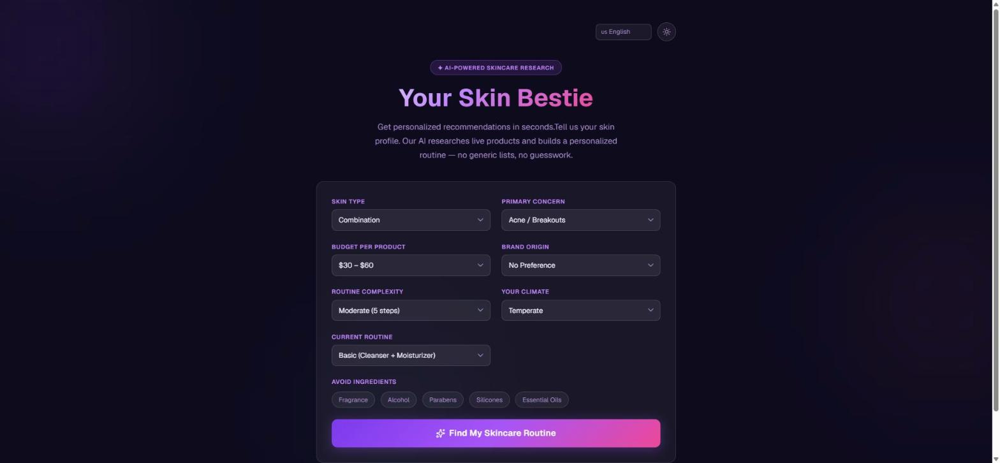
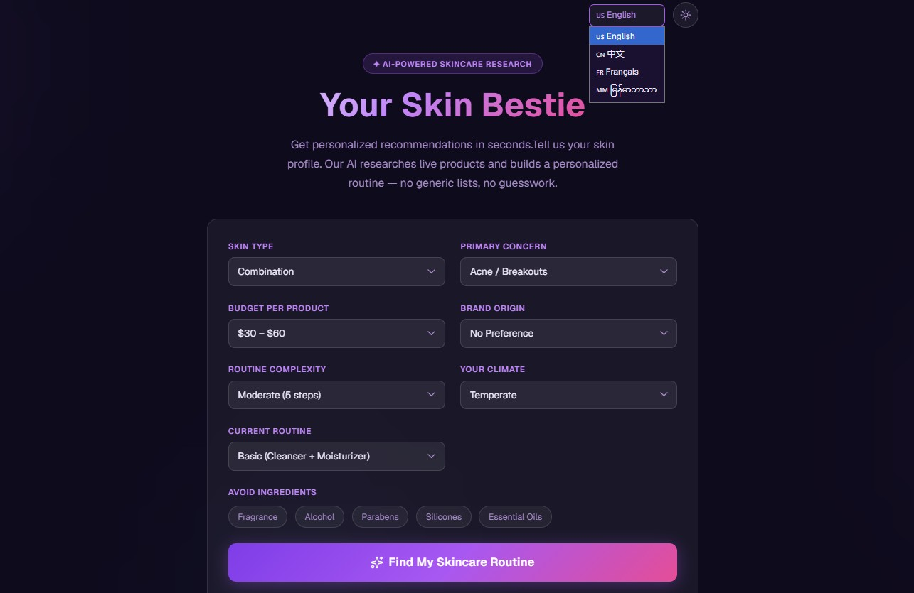
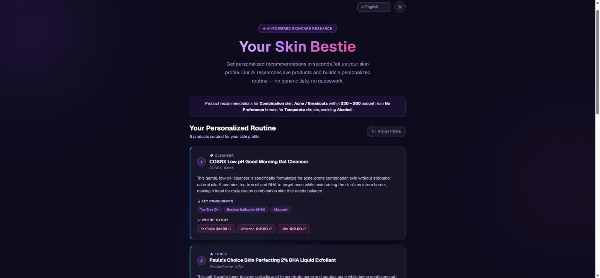
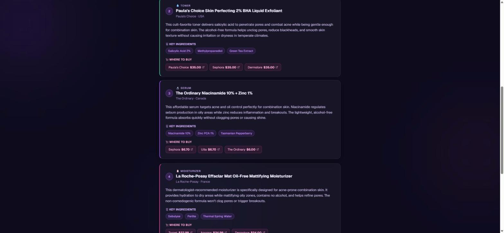
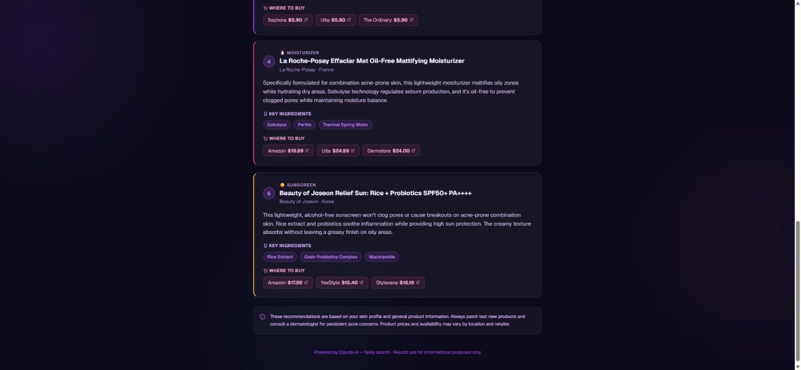

# Skincare Bestie

## 🎯 Your Personalized Skincare Routine in Seconds

Stop scrolling through endless skincare articles. **Skincare Bestie** uses AI to analyze your skin profile and find real products that actually work for YOU — with real prices, real ingredients, and real reviews from real stores.

- 🧴 Get 3/5/7 personalized products tailored to your skin
- 💰 Filter by budget ($30-$100+)
- 🌍 Choose from Korean, Japanese, European, or American brands
- ✨ See exactly where to buy each product (Amazon, Sephora, Ulta, Target)

**Live demo:** [skincare-bestie.vercel.app](https://skincare-bestie.vercel.app/)

## What is this project?

**Skincare Bestie** is a full-stack Next.js application (App Router) that delivers personalized skincare product recommendations based on your unique skin profile. Using an interactive filter form, you specify your skin type, concerns, budget, brand preferences, and more. The app then leverages Claude AI with Tavily MCP integration to research real, currently available skincare products and curates a customized routine tailored to your needs.

The results are presented as a clean, interactive dashboard showing each product step with ingredient highlights and direct purchase links.

### Features

- **🎨 Smart Filter Form** (8 interactive filters)
  Skin type, primary concern, budget, brand origin, routine complexity, ingredients to avoid, climate, current routine level
  
- **🤖 AI-Powered by Claude Sonnet 4.5**
  Analyzes your unique skin profile and generates personalized recommendations
  
- **🔍 Live Product Research via Tavily**
  Searches the web for current products with real-time pricing (not outdated databases)
  
- **🎯 Multi-Language Support**
  English, Chinese (中文), French (Français), Burmese (မြန်မာဘာသာ)
  
- **🌙 Dark/Light Mode**
  Customizable interface for any lighting condition
  
- **📊 Results Dashboard**
  Step-by-step routine with product details, key ingredients, and direct purchase links
  
## 💡 Who's This For?

- **Skincare Beginners** — No idea where to start? Get a curated routine without the overwhelm
- **Sensitive Skin** — Filter to avoid fragrance, alcohol, parabens, silicones, essential oils
- **Budget-Conscious** — Set max price per product and find quality options
- **K-Beauty Enthusiasts** — Korean, Japanese, European, or American brands at your fingertips
- **Travel Packing** — Build a routine for different climates (humid, dry, temperate, cold)
- **Routine Overhaul** — Simplify (3-step) or go comprehensive (7+ steps)

 
## How It Works

1. User fills out the FilterForm with 8 filters (skin type, concern, budget, etc.)
2. Click 'Find My Skincare Routine'.
3. AI search for best fit products with given filters.
4. `ResultsDashboard` renders each product as a step card with:
   - Product name, brand, and origin
   - Match reason and key ingredients
   - Vendor links with prices

## Screenshots







## Tech Stack

- **Frontend**: [Next.js 16](https://nextjs.org/) (App Router), React 19, TailwindCSS 4
- **Backend**: Next.js API Routes
- **AI**: [Claude (Sonnet 4.5)](https://www.anthropic.com/claude)
- **Search**: [Tavily MCP](https://tavily.com/) for live web research
- **Styling**: TailwindCSS 4 + Lucide icons
- **Language**: TypeScript 5

## Project Structure

```
skincare-bestie/
├── app/
│   ├── page.tsx                   # Main client page (filter form + results state)
│   └── api/
│       └── recommend/route.ts     # POST handler: filters → Claude + Tavily → JSON response
├── components/
│   ├── FilterForm.tsx             # 8-filter form component
│   └── ResultsDashboard.tsx       # Results display with step cards & vendor links
├── lib/
│   ├── types.ts                   # TypeScript interfaces (UserFilters, ProductRecommendation, RoutineResponse)
│   └── aiConfig.ts                # AI config switch (Anthropic vs 9Router proxy)
├── data/
│   └── mockRecommendations.json   # Fixture data for mock mode
├── .claude/
│   ├── skills/add-product/        # Skill: research and add real products to mock data
│   └── agents/                    # Subagent: product-researcher
├── .mcp.json                      # Tavily MCP server config
├── .env.local                     # Environment variables (gitignored)
└── package.json                   # Dependencies & scripts
```

## Getting Started

### Prerequisites

- Node.js 18+ and npm/yarn/pnpm/bun
- Tavily API key (for live product search)
- Anthropic API key (for Claude AI, when not using mock data)

### Installation

1. **Clone the repository**

   ```bash
   git clone https://github.com/HlaingThinPhyu/skincare-bestie.git
   cd skincare-bestie
   ```

2. **Install dependencies**

   ```bash
   npm install
   ```

3. **Set up environment variables**

   Copy and update `.env.local`:

   ```bash
   cp .env.example .env.local
   ```

   Required variables:

   ```
   USE_MOCK_DATA=true              # true = use fixture, false = call Claude
   USE_NINEROUTER=false            # true = use 9Router proxy
   TAVILY_API_KEY=your_key_here    # Required for live search
   ANTHROPIC_API_KEY=your_key_here # Required for Claude (when USE_NINEROUTER=false)
   ANTHROPIC_BASE_URL=anthropic_url_endpoint_here # Required for Claude
   ANTHROPIC_MODEL=your_model_here # Required for Claude
   ```

4. **Run the development server**

   ```bash
   npm run dev
   ```

   Open [http://localhost:3000](http://localhost:3000) in your browser.

## Quick Test

Test with mock data (no API keys needed) — set in `.env.local`:

```
USE_MOCK_DATA=true
```

Then navigate to the UI and submit a profile.

**Test the API directly:**

```bash
curl -X POST http://localhost:3000/api/recommend \
  -H "Content-Type: application/json" \
  -d '{
    "skinType": "dry",
    "primaryConcern": "aging",
    "budget": "60-100",
    "brandOrigin": "any",
    "routineComplexity": "moderate",
    "avoidIngredients": [],
    "climate": "cold",
    "currentRoutine": "basic"
  }' | jq '.products | length'
```

## Development

**Available scripts:**

```bash
npm run dev      # Start dev server with hot reload
npm run build    # Build for production
npm start        # Start production server
npm run lint     # Run ESLint
```

## Environment Variables

| Variable | Values | Purpose |
|---|---|---|
| `USE_MOCK_DATA` | `true` \| `false` | Skip AI, return mock fixture immediately |
| `TAVILY_API_KEY` | API key string | Enable live web search for products |
| `ANTHROPIC_API_KEY` | API key string | Claude API access (when `USE_NINEROUTER=false`) |

## ⚠️ Known Limitations & Future Work

- **Product Pricing** - Based on most recent web search (prices change daily)
- **Ingredient Lists** - Sourced from product pages (may not be 100% complete)
- **Regional Availability** - Some products may not ship to all countries
- **Customization** - Limited to 8 filter categories (feedback welcome!)

### Planned Features
- Share routines with friends
- Reviews/ratings from real users
- Integration with Skin Type API

  
## 📄 License

MIT License - See [LICENSE](./LICENSE) file

## 🙏 Credits

- Built with [Next.js 16](https://nextjs.org)
- Powered by [Claude AI](https://anthropic.com) & [Tavily Search](https://tavily.com)
- UI designed with [TailwindCSS 4](https://tailwindcss.com) & [Lucide Icons](https://lucide.dev)
- Hosted on [Vercel](https://vercel.com)

## 📧 Feedback

Have questions or feature requests? Open an [issue](https://github.com/HlaingThinPhyu/skincare-bestie/issues) or send a PR!


